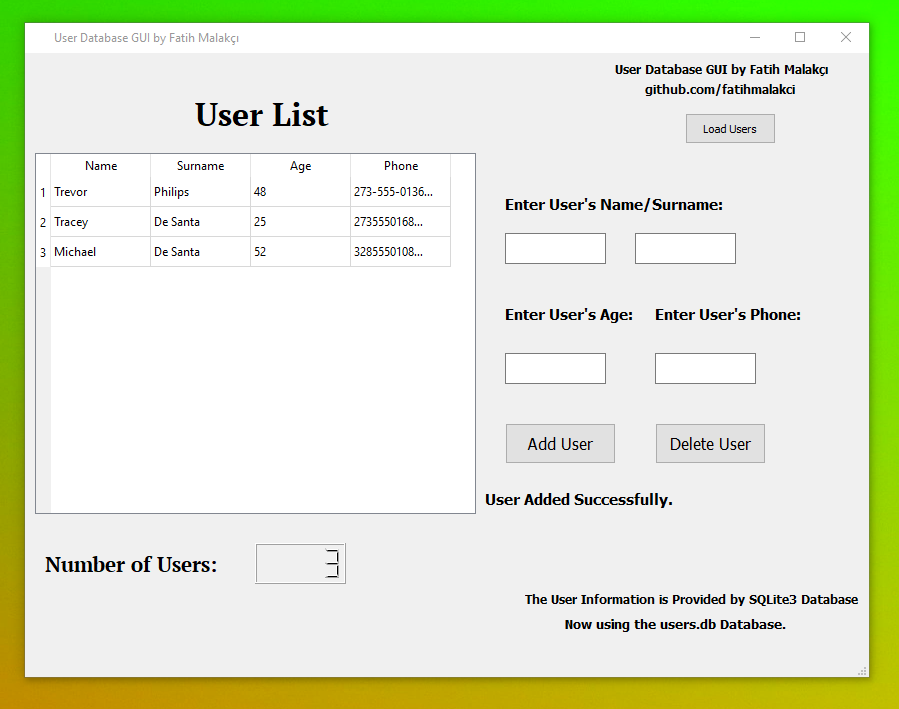

# User Database GUI

     

**A simple Python PyQT5 GUI application for storing users names, age and phone numbers in a SQLite3 database.**

## Usage :

## For Adding Users :

- Fill all the required areas and click add user button.

## For Deleting Users : 

- Fill the Name/Surname areas and click delete user button.

## Requirements :

- Python3
- PyQT5 Module

